# 设计文档：Token 用量追踪与展示

## 概述

本功能在现有的 Agent 输出解析管道中增加 Token 用量数据提取能力，通过已有的 `token_usage_info` NormalizedEntry 类型和 JSON Patch 机制将数据传输到前端，并在 Web UI 中展示累计 Token 用量摘要。

设计遵循以下原则：
- 各 Parser 独立提取各自 Agent 的 Token 数据，产出统一的 `token_usage_info` NormalizedEntry
- 前端只感知 NormalizedEntry/LogEntry，不感知具体 Agent 类型
- "展示已有数据"策略：有什么展示什么，优雅处理缺失字段
- Token 用量提取失败不影响正常会话功能

## 架构

### 数据流

```mermaid
graph LR
    A[Agent CLI PTY] --> B[Parser]
    B -->|token_usage_info NormalizedEntry| C[MsgStore]
    C -->|JSON Patch via EventBus| D[WebSocket]
    D --> E[Frontend Socket Handler]
    E -->|NormalizedEntry| F[LogAdapter]
    F -->|LogEntry| G[TokenUsageSummary 聚合]
    G --> H[TokenUsageBar UI 组件]
```



### 修改范围

本功能主要修改以下层：

1. **Parser 层**（服务端）：`ClaudeCodeParser`、`CursorAgentParser` 增加 Token 数据提取
2. **Adapter 层**（共享）：`log-adapter.ts` 已有 `token_usage_info` 映射，需微调
3. **UI 层**（前端）：新增 `TokenUsageBar` 组件和 `useTokenUsage` Hook

MsgStore、AgentPipeline、WebSocket 层无需修改，因为 `token_usage_info` 作为普通 NormalizedEntry 已经能通过现有管道传输。

## 组件与接口

### 1. ClaudeCodeParser 扩展

Claude Code 的 `result` 消息（`type: "result"`, `subtype: "success"`）包含累计 `usage` 字段：

```json
{
  "type": "result",
  "subtype": "success",
  "usage": {
    "input_tokens": 1234,
    "output_tokens": 567,
    "cache_creation_input_tokens": 100,
    "cache_read_input_tokens": 200
  },
  "total_cost_usd": 0.05
}
```

修改 `handleResultMessage` 方法，在处理 `tool_result` 之外增加对 `subtype: "success"` 的处理：

```typescript
// claude-code-parser.ts - handleResultMessage 扩展
private handleResultMessage(msg: ClaudeCodeMessage): void {
  if (msg.subtype === 'tool_result' && msg.tool_use_id) {
    // 现有逻辑不变
  }

  // 新增：从 success result 中提取 token 用量
  if (msg.subtype === 'success' && msg.usage) {
    try {
      const usage = msg.usage as Record<string, number>
      const entry = createTokenUsageInfo(
        usage.input_tokens || 0,
        usage.output_tokens || 0,
        usage.cache_read_input_tokens || 0,
        usage.cache_creation_input_tokens || 0
      )
      const index = this.indexProvider.next()
      const patch = addNormalizedEntry(index, entry)
      this.msgStore.pushPatch(patch)
    } catch {
      // 需求 7.1：提取失败不影响正常解析
    }
  }
}
```

需要扩展 `ClaudeCodeMessage` 接口，增加 `usage` 字段：

```typescript
interface ClaudeCodeMessage {
  // ... 现有字段
  usage?: {
    input_tokens?: number
    output_tokens?: number
    cache_creation_input_tokens?: number
    cache_read_input_tokens?: number
  }
}
```

### 2. CursorAgentParser 扩展

Cursor Agent 的 `result` 消息可能包含 Token 用量数据（不保证）。修改 `parseLine` 中对 `result` 类型的处理：

```typescript
// cursor-agent-parser.ts - 在 parseLine 的 switch 中
case 'result': {
  const resultMsg = msg as CursorJsonResult
  if (resultMsg.result && typeof resultMsg.result === 'object') {
    const result = resultMsg.result as Record<string, unknown>
    const usage = result.usage as Record<string, number> | undefined
    if (usage) {
      try {
        const entry = createTokenUsageInfo(
          usage.input_tokens || usage.inputTokens || 0,
          usage.output_tokens || usage.outputTokens || 0,
          usage.cache_read_input_tokens || 0,
          usage.cache_creation_input_tokens || 0
        )
        const index = this.indexProvider.next()
        const patch = addNormalizedEntry(index, entry)
        this.msgStore.pushPatch(patch)
      } catch {
        // 提取失败静默跳过
      }
    }
  }
  break
}
```

### 3. LogAdapter 微调

现有 `log-adapter.ts` 已将 `token_usage_info` 映射为 `LogType.Info`。为了让前端能区分 Token 用量条目并进行聚合，需要在 LogEntry 中保留结构化的 Token 数据：

```typescript
// log-adapter.ts 中扩展 LogEntry 接口
export interface LogEntry {
  id: string
  type: LogType
  content: string
  title?: string
  isCollapsed?: boolean
  children?: LogEntry[]
  tokenUsage?: {
    inputTokens: number
    outputTokens: number
    cacheReadTokens: number
    cacheWriteTokens: number
  }
}
```

修改 `normalizedEntryToLogEntry` 中 `token_usage_info` 的映射：

```typescript
case 'token_usage_info':
  if (entry.metadata?.tokenUsage) {
    const { inputTokens, outputTokens, cacheReadTokens, cacheWriteTokens } = entry.metadata.tokenUsage
    return {
      id: entry.id,
      type: LogType.Info,
      content: `Token 使用: 输入 ${inputTokens || 0}, 输出 ${outputTokens || 0}`,
      tokenUsage: {
        inputTokens: inputTokens || 0,
        outputTokens: outputTokens || 0,
        cacheReadTokens: cacheReadTokens || 0,
        cacheWriteTokens: cacheWriteTokens || 0,
      },
    }
  }
  return null
```

### 4. useTokenUsage Hook

前端 React Hook，从 LogEntry 数组中聚合 Token 用量：

```typescript
// packages/web/src/hooks/useTokenUsage.ts
import { useMemo } from 'react'
import type { LogEntry } from '@agent-tower/shared/log-adapter'

export interface TokenUsageSummary {
  inputTokens: number
  outputTokens: number
  cacheReadTokens: number
  cacheWriteTokens: number
  totalTokens: number
}

export function useTokenUsage(logs: LogEntry[]): TokenUsageSummary | null {
  return useMemo(() => {
    const tokenLogs = logs.filter(log => log.tokenUsage)
    if (tokenLogs.length === 0) return null

    const summary = tokenLogs.reduce(
      (acc, log) => {
        acc.inputTokens += log.tokenUsage!.inputTokens
        acc.outputTokens += log.tokenUsage!.outputTokens
        acc.cacheReadTokens += log.tokenUsage!.cacheReadTokens
        acc.cacheWriteTokens += log.tokenUsage!.cacheWriteTokens
        return acc
      },
      { inputTokens: 0, outputTokens: 0, cacheReadTokens: 0, cacheWriteTokens: 0 }
    )

    return {
      ...summary,
      totalTokens: summary.inputTokens + summary.outputTokens,
    }
  }, [logs])
}
```

### 5. TokenUsageBar 组件

固定在日志流区域底部的 Token 用量摘要栏：

```typescript
// packages/web/src/components/agent/TokenUsageBar.tsx
interface TokenUsageBarProps {
  summary: TokenUsageSummary | null
}

export function TokenUsageBar({ summary }: TokenUsageBarProps) {
  if (!summary) return null

  return (
    <div className="flex items-center gap-4 px-4 py-2 text-xs text-neutral-500 bg-neutral-50 border-t border-neutral-100">
      <span>输入: {formatNumber(summary.inputTokens)}</span>
      <span>输出: {formatNumber(summary.outputTokens)}</span>
      {summary.cacheReadTokens > 0 && (
        <span>缓存读取: {formatNumber(summary.cacheReadTokens)}</span>
      )}
      <span className="ml-auto font-medium text-neutral-700">
        总计: {formatNumber(summary.totalTokens)}
      </span>
    </div>
  )
}

function formatNumber(n: number): string {
  if (n >= 1_000_000) return `${(n / 1_000_000).toFixed(1)}M`
  if (n >= 1_000) return `${(n / 1_000).toFixed(1)}K`
  return n.toString()
}
```

## 数据模型

### 现有数据结构（无需修改）

`NormalizedEntry.metadata.tokenUsage` 已定义：

```typescript
tokenUsage?: {
  inputTokens?: number
  outputTokens?: number
  cacheReadTokens?: number
  cacheWriteTokens?: number
}
```

`createTokenUsageInfo()` 辅助函数已存在于 `types.ts`。

### 新增数据结构

前端 `LogEntry` 扩展（在 `log-adapter.ts` 中）：

```typescript
// LogEntry 新增可选字段
tokenUsage?: {
  inputTokens: number
  outputTokens: number
  cacheReadTokens: number
  cacheWriteTokens: number
}
```

前端聚合摘要类型：

```typescript
interface TokenUsageSummary {
  inputTokens: number
  outputTokens: number
  cacheReadTokens: number
  cacheWriteTokens: number
  totalTokens: number  // inputTokens + outputTokens
}
```

### Claude Code usage 字段映射

| Claude Code 字段 | NormalizedEntry 字段 |
|---|---|
| `input_tokens` | `inputTokens` |
| `output_tokens` | `outputTokens` |
| `cache_read_input_tokens` | `cacheReadTokens` |
| `cache_creation_input_tokens` | `cacheWriteTokens` |


## 正确性属性

*正确性属性是一种在系统所有有效执行中都应成立的特征或行为——本质上是关于系统应该做什么的形式化陈述。属性是人类可读规范与机器可验证正确性保证之间的桥梁。*

### Property 1: Claude Code Token 提取正确性

*For any* 包含 `usage` 字段的 Claude Code result 消息（`type: "result"`, `subtype: "success"`），其中 usage 字段包含任意子集的 `input_tokens`、`output_tokens`、`cache_creation_input_tokens`、`cache_read_input_tokens`（值为非负整数），Parser 生成的 `token_usage_info` NormalizedEntry 中的 `inputTokens` 应等于 `input_tokens`（缺失则为 0），`outputTokens` 应等于 `output_tokens`（缺失则为 0），`cacheReadTokens` 应等于 `cache_read_input_tokens`（缺失则为 0），`cacheWriteTokens` 应等于 `cache_creation_input_tokens`（缺失则为 0）。

**Validates: Requirements 1.1, 1.3**

### Property 2: Cursor Agent Token 提取正确性

*For any* 包含 Token 用量数据的 Cursor Agent result 消息，Parser 生成的 `token_usage_info` NormalizedEntry 中的各 Token 字段应与原始数据中的对应字段值一致（缺失字段为 0）。

**Validates: Requirements 2.1**

### Property 3: Token 用量数据 MsgStore 往返一致性

*For any* 有效的 `token_usage_info` NormalizedEntry，将其通过 `addNormalizedEntry` 生成 JSON Patch 推入 MsgStore 后，从 MsgStore 的 snapshot 中取出的对应条目应与原始条目在 `entryType`、`metadata.tokenUsage` 各字段上等价。

**Validates: Requirements 3.2, 6.1**

### Property 4: LogAdapter Token 转换正确性

*For any* `entryType` 为 `token_usage_info` 且 `metadata.tokenUsage` 非空的 NormalizedEntry，`normalizedEntryToLogEntry` 应返回一个非 null 的 LogEntry，且该 LogEntry 的 `tokenUsage` 字段中各数值应与输入 NormalizedEntry 的 `metadata.tokenUsage` 对应字段一致（缺失字段默认为 0）。

**Validates: Requirements 3.3**

### Property 5: Token 聚合正确性

*For any* LogEntry 数组，其中包含零个或多个带有 `tokenUsage` 字段的条目，`useTokenUsage` Hook 返回的 `TokenUsageSummary` 中：`inputTokens` 应等于所有条目 `tokenUsage.inputTokens` 之和，`outputTokens` 应等于所有条目 `tokenUsage.outputTokens` 之和，`cacheReadTokens` 和 `cacheWriteTokens` 同理，且 `totalTokens` 应等于 `inputTokens + outputTokens`。当没有任何带 `tokenUsage` 的条目时，返回 null。

**Validates: Requirements 4.1, 4.3**

### Property 6: TokenUsageBar 渲染完整性

*For any* 非 null 的 `TokenUsageSummary`，`TokenUsageBar` 组件的渲染输出应包含 `inputTokens`、`outputTokens` 和 `totalTokens` 的格式化数值文本。

**Validates: Requirements 5.2**

### Property 7: Parser 错误容错

*For any* 包含格式异常 `usage` 字段（如字符串类型、嵌套对象、负数等）的 Claude Code result 消息，Parser 不应抛出异常，且应继续正常处理后续消息。

**Validates: Requirements 7.1**

### Property 8: 前端聚合错误容错

*For any* LogEntry 数组，其中混合了正常 `tokenUsage` 条目和格式异常条目（如字段为 NaN、undefined），聚合函数应忽略异常条目，仅对有效条目进行累加。

**Validates: Requirements 7.2**

## 错误处理

### Parser 层

- Token 用量提取包裹在 try-catch 中，异常时静默跳过（记录 console.warn）
- 不影响同一消息中其他字段（如 tool_result）的处理
- 缺失字段默认为 0，不视为错误

### 传输层

- `token_usage_info` 作为普通 NormalizedEntry 通过现有 JSON Patch 管道传输
- MsgStore 的 `applyPatch` 已有 try-catch 保护，无效 patch 会被跳过

### 前端层

- `useTokenUsage` Hook 过滤掉 `tokenUsage` 为 undefined/null 的条目
- 对数值字段使用 `|| 0` 防御 NaN/undefined
- `TokenUsageBar` 在 summary 为 null 时返回 null（不渲染）

## 测试策略

### 属性测试（Property-Based Testing）

使用 `fast-check` 库进行属性测试，每个属性测试至少运行 100 次迭代。

每个测试需标注对应的设计属性：
- 格式：`Feature: token-usage-display, Property N: {property_text}`

属性测试覆盖：
- Property 1-2：Parser 层 Token 提取正确性
- Property 3：MsgStore 往返一致性
- Property 4：LogAdapter 转换正确性
- Property 5：前端聚合正确性
- Property 7-8：错误容错

### 单元测试

单元测试覆盖具体示例和边界情况：
- Claude Code result 消息无 usage 字段（需求 1.2 边界情况）
- Cursor Agent result 消息无 Token 数据（需求 2.2 边界情况）
- 零值 Token 字段的序列化保留（需求 6.2 边界情况）
- TokenUsageBar 在 cacheReadTokens > 0 时展示缓存信息（需求 5.3）
- TokenUsageBar 在 summary 为 null 时不渲染（需求 5.4）
- `formatNumber` 函数的 K/M 格式化

### 测试文件组织

```
packages/server/src/output/__tests__/
  claude-code-parser-token.test.ts    # Property 1, 7 + 边界用例
  cursor-agent-parser-token.test.ts   # Property 2 + 边界用例
  msg-store-token.test.ts             # Property 3

packages/shared/src/__tests__/
  log-adapter-token.test.ts           # Property 4

packages/web/src/hooks/__tests__/
  useTokenUsage.test.ts               # Property 5, 8

packages/web/src/components/agent/__tests__/
  TokenUsageBar.test.tsx              # Property 6 + 边界用例
```
